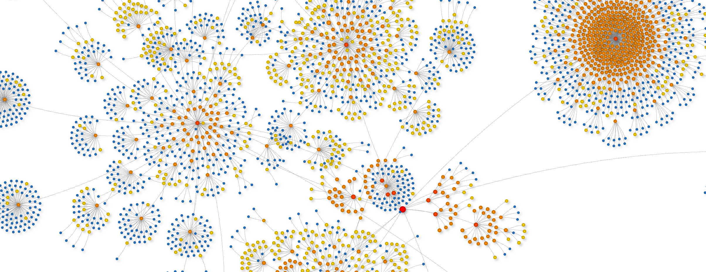
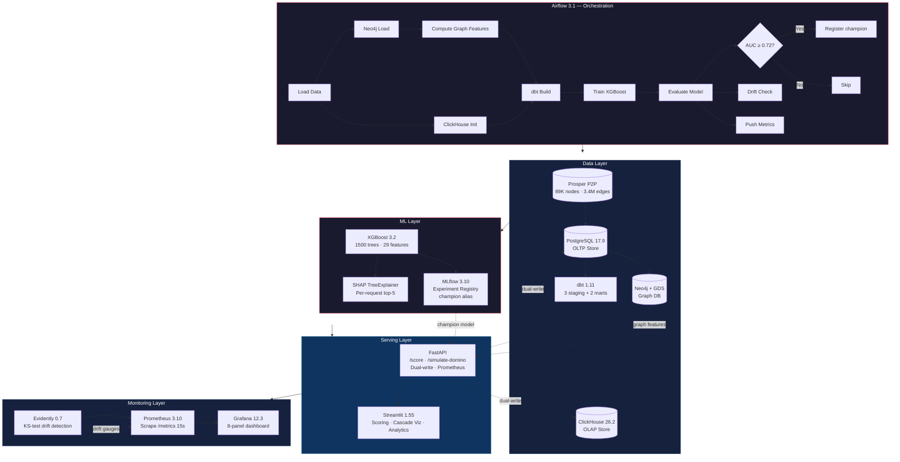
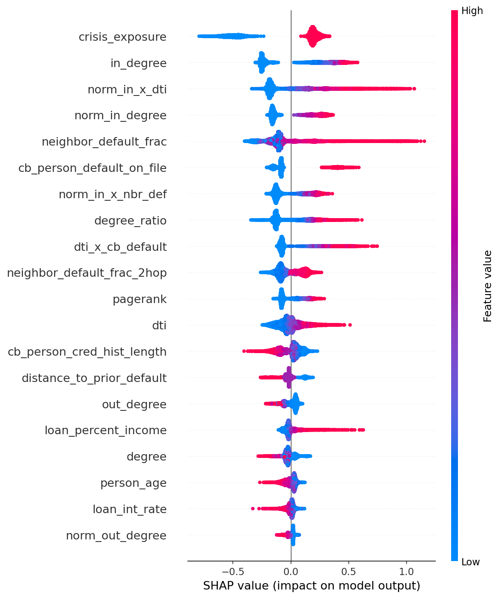
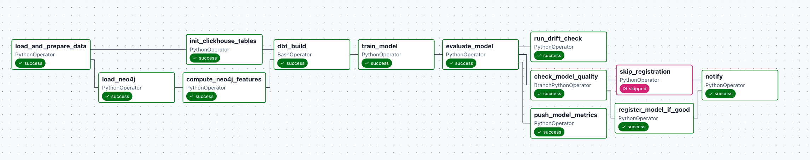

<p align="center">
  <h1 align="center">Billy - Credit Domino</h1>
  <p align="center">
    <strong>End-to-end credit risk scoring with graph-based contagion simulation</strong>
    <br />
    <em>From a 89K-node lending network to production-grade ML serving in 9 containers</em>
  </p>
  <p align="center">
    
    
    
    
    
    
    
    
    
    
  </p>
</p>

<p align="center">
  
</p>

---

## The Problem

A lender needs to answer two questions at decision time:

1. **Should we approve this loan?** — Predict the probability of default using both the applicant's financial profile and their position in a borrower network.
2. **What happens if they default?** — Simulate how financial stress cascades through co-borrower, guarantor, and employer relationships — the *domino effect* of interconnected credit risk.

Traditional credit models treat applicants as independent. In reality, defaults propagate through relationship networks. A borrower whose three co-borrowers just defaulted is categorically different from one whose network is healthy — even if their income and credit score are identical.

## The Solution

**Credit Domino** is a production-grade ML system that combines tabular credit features with graph-derived contagion metrics to score borrowers and simulate systemic risk cascades across a real-world P2P lending network.

### Key Results

| Metric | Value |
|:-------|------:|
| **ROC-AUC** | **0.829** |
| **Accuracy** | 75.5% |
| **Precision** | 63.6% |
| **Recall** | 77.5% |
| **F1 Score** | 0.699 |
| **Scoring latency (p50)** | **2.2 ms** |
| **Scoring latency (p95)** | **5.6 ms** |
| **Scoring latency (p99)** | **7.8 ms** |
| **Graph scale** | 89,171 nodes · 3.4M edges |
| **Features** | 29 (12 tabular + 10 graph + 7 interactions) |
| **Training set** | 71,336 samples (80/20 stratified) |
| **Test set** | 17,835 samples |

<sub>Latency measured across 300 sequential requests against the Dockerized API. p50/p95/p99 reported for cached (returning customer) requests. First-seen customers incur a one-time Postgres graph feature lookup (~130 ms).</sub>

---

## Architecture



All 9 services start with a single `docker compose up -d` and self-configure: Grafana dashboards are auto-provisioned, ClickHouse materialized views are created by the DAG, and the API hot-reloads the champion model on promotion.

---

## What Makes This Different

### 1. Graph features are first-class citizens, not afterthoughts

The model uses **10 graph-derived features** computed from the real Prosper P2P lending network (89,171 borrowers, 3.4M directed edges from [KONECT](http://konect.cc/networks/prosper-loans/)):

| Feature | Computation | Signal |
|---------|-------------|--------|
| `neighbor_default_frac` | 1-hop default rate | Direct contagion exposure |
| `neighbor_default_frac_2hop` | 2-hop default rate | Second-order network risk |
| `degree` / `in_degree` / `out_degree` | Degree centrality | Network connectivity |
| `norm_in_degree` / `norm_out_degree` | Normalized degree | Relative network position |
| `pagerank` | PageRank centrality | Systemic importance |
| `distance_to_prior_default` | Multi-source BFS | Proximity to known defaults |
| `clustering_coefficient` | Local transitivity | Network density around borrower |

Plus **7 engineered interaction features** that capture cross-domain signals:

| Feature | Formula | Intuition |
|---------|---------|-----------|
| `norm_in_x_dti` | `norm_in_degree × loan_percent_income` | High DTI + high inbound connections = contagion amplifier |
| `norm_in_x_nbr_def` | `norm_in_degree × neighbor_default_frac` | Connected borrowers with defaulting neighbors |
| `dti_x_cb_default` | `loan_percent_income × cb_person_default_on_file` | Over-leveraged repeat defaulters |
| `crisis_exposure` | `neighbor_default_frac × loan_percent_income × (1 + cb_default)` | Composite systemic risk score |
| `degree_ratio` | `in_degree / (out_degree + 1)` | Asymmetric lending relationships |
| `dti` | `loan_amnt / (person_income + 1)` | Debt-to-income ratio |
| `is_recent_default` | Binary flag | Recency signal |

### 2. SHAP explainability on every prediction

Every scoring response includes the **top-5 SHAP factors** (TreeExplainer) showing *why* the model scored this borrower the way it did. This isn't a batch report — it's per-request, sub-10ms explainability in production.

<p align="center">
  
</p>

<details>
<summary><strong>SHAP Interpretation Guide</strong></summary>

The SHAP summary plot reveals how each feature drives model predictions:

- **`crisis_exposure`** (top feature) — The composite systemic risk score. High values (red, right side) strongly push predictions toward default. A single-feature systemic risk indicator that combines network contagion with financial leverage.

- **`neighbor_default_frac`** — Direct neighborhood default rate. When a borrower's immediate neighbors are defaulting (high values = red), the model aggressively predicts default. This is the core "domino effect" the system is designed to detect.

- **`norm_in_x_dti`** — The interaction between normalized in-degree and debt-to-income ratio. Borrowers who are both highly connected *and* over-leveraged carry disproportionate risk. This interaction wouldn't be captured by either feature alone.

- **`in_degree`** / **`norm_in_degree`** — Network connectivity. Counterintuitively, higher in-degree (more borrowers depending on you) *reduces* predicted default risk — well-connected borrowers tend to be more established.

- **`cb_person_default_on_file`** — Prior default history. Clean binary signal with strong rightward push when present.

- **`loan_percent_income`** — Loan-to-income ratio. High values linearly increase predicted default probability.

- **`pagerank`** — Systemic importance in the lending network. Low PageRank borrowers (blue) tend toward *higher* default risk — peripheral network nodes are less stable.

The key insight: **5 of the top 10 most important features are graph-derived or graph-interaction features**, validating the hypothesis that relationship network structure carries material signal for credit risk prediction.

</details>

### 3. Domino contagion simulation

Beyond individual scoring, the system simulates **cascade propagation** through the borrower network:

```bash
curl -X POST http://localhost:8000/simulate-domino \
  -H "Content-Type: application/json" \
  -d '{"trigger_customer_id":"PROSPER_0","initial_shock":1.0,"decay":0.6,"threshold":0.3,"max_hops":3}'
```

```json
{
  "trigger_customer_id": "PROSPER_0",
  "total_affected": 10,
  "total_fallen": 2,
  "max_hop": 2,
  "cascade": [
    {"customer_id": "PROSPER_0", "hop": 0, "stress": 1.0, "fallen": true},
    {"customer_id": "PROSPER_1", "hop": 1, "stress": 0.346, "fallen": true},
    {"customer_id": "PROSPER_237", "hop": 2, "stress": 0.17, "fallen": false}
  ]
}
```

The simulation uses **BFS-based stress propagation** with:
- **Edge-type weighting** — co-borrower links transmit more stress than employer links
- **DTI-based vulnerability** — over-leveraged borrowers amplify incoming stress
- **Configurable decay** — stress attenuates with network distance
- **Threshold-based default** — nodes "fall" when accumulated stress exceeds their resilience

<p align="center">
  
</p>

---

## Model Details

### Champion Model (MLflow Run `a8b97ef8`)

| Parameter | Value |
|:----------|------:|
| Algorithm | XGBoost (gradient boosted trees) |
| Trees | 1,500 |
| Max depth | 7 |
| Learning rate | 0.03 |
| Subsample | 0.8 |
| Min child weight | 3 |
| Gamma | 0.05 |
| Scale pos weight | 1.73 (class imbalance correction) |
| Optimal threshold | 0.441 (F1-maximized via precision-recall curve) |
| Total features | 29 |

### Feature Categories

| Category | Count | Features |
|----------|:-----:|----------|
| **Tabular** | 12 | `person_age`, `person_income`, `person_home_ownership`, `person_emp_length`, `loan_intent`, `loan_grade`, `loan_amnt`, `loan_int_rate`, `loan_percent_income`, `cb_person_default_on_file`, `cb_person_cred_hist_length`, `is_recent_default` |
| **Graph** | 10 | `degree`, `in_degree`, `out_degree`, `norm_in_degree`, `norm_out_degree`, `pagerank`, `distance_to_prior_default`, `clustering_coefficient`, `neighbor_default_frac`, `neighbor_default_frac_2hop` |
| **Interactions** | 7 | `norm_in_x_dti`, `norm_in_x_nbr_def`, `dti_x_cb_default`, `crisis_exposure`, `degree_ratio`, `dti`, `is_recent_default` |

### Model Selection Rationale

Three graph embedding approaches were evaluated for hybrid models:

| Method | Approach | Result |
|--------|----------|--------|
| **Spectral** (Laplacian Eigenmaps) | Truncated SVD on normalized Laplacian → XGBoost | +0.0002 AUC over vanilla (negligible — hand-crafted graph features already capture the signal) |
| **Node2Vec** | Random walk skip-gram | Infeasible at 89K × 10 walks × 20 steps (150M+ pairs) |
| **GraphSAGE** | Supervised GNN with mini-batch sampling | AUC 0.50 (random) due to oversmoothing on avg-degree-76 graph |

**Conclusion:** Hand-crafted graph features (neighbor default fractions, 2-hop contagion, PageRank) outperform learned embeddings on this graph topology. The dense, high-degree Prosper network causes GNN oversmoothing, while spectral embeddings capture redundant information. This is consistent with findings from [Shchur et al., 2019](https://arxiv.org/abs/1811.05868) on the limitations of GNNs on dense graphs.

The production model uses **XGBoost with hand-crafted features** — the approach that delivers the best AUC with deterministic, interpretable feature attributions via SHAP.

---

## API Performance

<sub>Benchmarked with 300 sequential requests against the Dockerized API (`docker compose up`)</sub>

| Metric | Value |
|:-------|------:|
| **Throughput** | ~450 req/s (cached) |
| **p50 latency** | 2.2 ms |
| **p95 latency** | 5.6 ms |
| **p99 latency** | 7.8 ms |
| **First-request latency** | ~130 ms (Postgres graph feature lookup) |
| **Health check** | < 4 ms |
| **Dual-write overhead** | Postgres + ClickHouse per scoring event |

### Scoring API Response

```json
{
  "scoring_event_id": "29a7fa3a-abec-4260-87d3-e0638d99fb3e",
  "customer_id": "PROSPER_0",
  "risk_score": 0.151,
  "decision_band": "low",
  "top_factors": [
    {"feature": "crisis_exposure", "shap_value": -0.517},
    {"feature": "neighbor_default_frac", "shap_value": -0.352},
    {"feature": "in_degree", "shap_value": -0.249},
    {"feature": "norm_in_x_dti", "shap_value": -0.195},
    {"feature": "neighbor_default_frac_2hop", "shap_value": -0.177}
  ],
  "scored_at": "2026-03-08T16:15:34.744506+00:00"
}
```

Every response is **dual-written** to:
- **PostgreSQL** — OLTP persistence with indexed lookups
- **ClickHouse** — OLAP analytics with `SummingMergeTree` materialized views for pre-aggregated hourly metrics

---

## Infrastructure

### Services (9 containers, single `docker compose up`)

| Service | Version | Port | Role |
|---------|---------|:----:|------|
| **FastAPI** | — | [8000](http://localhost:8000/docs) | Scoring API + domino simulation + Prometheus metrics |
| **Streamlit** | 1.55 | [8501](http://localhost:8501) | Interactive dashboard (scoring, cascade viz, analytics) |
| **MLflow** | 3.10.1 | [5001](http://localhost:5001) | Experiment tracking + model registry with `@champion` alias |
| **Airflow** | 3.1.7 | [8080](http://localhost:8080) | Pipeline orchestration (12-task DAG with quality gate) |
| **Neo4j** | 2026.02.2 | [7474](http://localhost:7474) | Graph database + GDS (PageRank, degree centrality) |
| **PostgreSQL** | 17.9 | 5433 | OLTP store (customers, relationships, graph features, scoring events) |
| **ClickHouse** | 26.2.4 | 8123 | OLAP analytics (scoring events + materialized hourly aggregation) |
| **Prometheus** | 3.10.0 | [9090](http://localhost:9090) | Metrics collection (scrapes API `/metrics` every 15s) |
| **Grafana** | 12.3.0 | [3000](http://localhost:3000) | Pre-provisioned 8-panel monitoring dashboard |

### Airflow DAG

<p align="center">
  
</p>

12-task DAG with **conditional branching**:

```
load_and_prepare_data
    ├──▸ load_neo4j ──▸ compute_neo4j_features ──┐
    └──▸ init_clickhouse_tables ──────────────────┤
                                                  ▼
                                              dbt_build
                                                  │
                                            train_model
                                                  │
                                           evaluate_model
                                          ╱       │       ╲
                              check_quality   drift_check   push_metrics
                               ╱        ╲
                     register @champion  skip
                               ╲        ╱
                                 notify
```

**Key design decisions:**
- Model is trained once, evaluated by reading MLflow metrics (no re-training)
- Quality gate: only promoted to `@champion` if AUC ≥ 0.72
- The API hot-reloads the champion model on promotion — **zero-downtime deployment**
- Graph features computed via Neo4j GDS in production, NetworkX in dev/CI (dual backend)

### Monitoring Stack

**Grafana dashboard** (auto-provisioned, zero config):

| Panel | Metric | Source |
|-------|--------|--------|
| Request rate | `rate(http_requests_total{handler="/score"}[5m])` | Prometheus |
| Latency p95 | `histogram_quantile(0.95, ...)` | Prometheus |
| Error rate | 5xx / total ratio | Prometheus |
| Risk band distribution | `credit_domino_scores_total` by band | Prometheus |
| API uptime | `up{job="credit-domino-api"}` | Prometheus |
| Model ROC-AUC | `credit_domino_model_auc` gauge | API → Prometheus |
| Drifted columns | `credit_domino_drift_columns` | Evidently → Prometheus |
| Drift share | `credit_domino_drift_share` | Evidently → Prometheus |

**Drift detection:** Evidently runs Kolmogorov-Smirnov tests on numeric features after each training cycle. Results are pushed to Prometheus via the API's `/monitoring/drift` endpoint, visible as Grafana gauges with alerting thresholds.

### Data Pipeline (dbt)

| Layer | Model | Materialization | Purpose |
|-------|-------|:---------------:|---------|
| Staging | `stg_customers` | View | Type-cast, filter (age > 18, income > 0) |
| Staging | `stg_relationships` | View | Edge validation, self-loop removal |
| Staging | `stg_graph_features` | View | Type-cast graph metrics |
| Mart | `fct_credit_features` | Table | Joined customer + graph features with risk bands |
| Mart | `fct_scoring_log` | Incremental | Append-only scoring event log (CDC-ready) |

Schema enforcement via `schema.yml`: uniqueness, not-null, accepted values. Custom macro `interest_rate_risk_band` for SQL-level risk categorization.

---

## Quick Start

### Prerequisites
- Docker & Docker Compose
- Python 3.13+ (for local dev)

### 1. Start everything (Docker)

```bash
git clone https://github.com/<your-username>/credit-domino && cd credit-domino
docker compose up -d --build           # 9 services (~3 min first build)
docker compose ps -a                    # verify all healthy
```

### 2. Trigger the pipeline

Open [Airflow UI](http://localhost:8080) (credentials: `admin` / check `docker compose logs airflow | grep password`), enable the `credit_domino_pipeline` DAG, and trigger it. The DAG will:
1. Load 89K borrowers from the Prosper P2P dataset
2. Compute graph features (degree, PageRank, neighbor default rates)
3. Load the graph into Neo4j
4. Run dbt (staging + marts)
5. Train XGBoost (1,500 trees, 29 features)
6. Evaluate and promote to `@champion` if AUC ≥ 0.72
7. Run drift detection and push metrics to Prometheus

### 3. Score a borrower

```bash
curl -X POST http://localhost:8000/score \
  -H "Content-Type: application/json" \
  -d '{
    "customer_id": "PROSPER_42",
    "person_age": 35,
    "person_income": 60000,
    "person_home_ownership": "RENT",
    "person_emp_length": 5,
    "loan_intent": "PERSONAL",
    "loan_grade": "B",
    "loan_amnt": 10000,
    "loan_int_rate": 11.5,
    "loan_percent_income": 0.17,
    "cb_person_default_on_file": 0,
    "cb_person_cred_hist_length": 8
  }'
```

### 4. Explore

| What | Where |
|------|-------|
| Interactive scoring + cascade viz | [localhost:8501](http://localhost:8501) (Streamlit) |
| API documentation | [localhost:8000/docs](http://localhost:8000/docs) (Swagger UI) |
| Model experiments | [localhost:5001](http://localhost:5001) (MLflow) |
| Graph exploration | [localhost:7474](http://localhost:7474) (Neo4j Browser) |
| Monitoring dashboard | [localhost:3000](http://localhost:3000) (Grafana, `admin`/`admin`) |
| Pipeline runs | [localhost:8080](http://localhost:8080) (Airflow) |
| Metrics endpoint | [localhost:8000/metrics](http://localhost:8000/metrics) (Prometheus format) |

### Local development

```bash
conda create -n credit-domino python=3.13 -y && conda activate credit-domino
pip install -e ".[dev]"

python scripts/prepare_credit_data.py   # CSV → Postgres + graph features
cd dbt && dbt build --profiles-dir . --project-dir . && cd ..
python scripts/train_model.py           # Train, evaluate, register @champion
uvicorn credit_domino.api:app --reload --port 8000
```

---

## Testing

```
61 tests · 7 modules · ~10 seconds
```

```bash
pytest tests/ -v                        # run all tests
ruff check src/ tests/                  # lint
ruff format --check src/ tests/         # format check
```

| Module | Tests | What's Covered |
|--------|:-----:|----------------|
| API | 8 | Request/response contracts, validation errors, health/ready probes |
| Data loading | 12 | Column integrity, null handling, outlier filtering, deterministic graph generation |
| dbt | 4 | Schema compilation, incremental config, test presence |
| Graph features | 7 | Feature completeness, type correctness, BFS distance, determinism |
| Modeling | 14 | Feature assembly, label encoding, training convergence, SHAP computation |
| Drift monitoring | 2 | Report structure, feature column coverage |
| Simulation | 8 | Cascade propagation, decay mechanics, threshold behavior, star graph topology |
| Smoke | 6 | Config loading, structured logging, module importability |

**CI pipeline** (GitHub Actions): Lint → Test (with Postgres service container) → dbt compile → Docker build.

---

## Tech Stack

| Layer | Tool | Why This Tool |
|-------|------|---------------|
| **OLTP** | PostgreSQL 17.9 | Source-of-truth for borrower profiles, relationships, and scoring events. Every prediction is persisted with indexed customer lookups. |
| **OLAP** | ClickHouse 26.2 | Scoring events are dual-written for sub-second analytical queries. `SummingMergeTree` with materialized views provides pre-aggregated hourly metrics without impacting API latency at scale. |
| **Graph** | Neo4j 2026.02 + GDS | PageRank and degree centrality on the 89K-node, 3.4M-edge Prosper graph. GDS provides scalable graph algorithms; a dual NetworkX backend enables CI testing without Neo4j. |
| **Transforms** | dbt 1.11 | SQL-based transformations with schema enforcement (`schema.yml` tests), incremental materialization for the scoring log, and built-in data lineage. |
| **ML** | XGBoost 3.2 + SHAP | Gradient boosted trees with per-prediction explainability via TreeExplainer. Every API response includes the top-5 features that drove the risk score. |
| **Registry** | MLflow 3.10 | Experiment tracking with artifact persistence (models, label encoders, SHAP plots). Alias-based promotion (`@champion`) enables zero-downtime model updates. |
| **Orchestration** | Airflow 3.1 | 12-task DAG with conditional branching: the model is only promoted if AUC passes the quality gate. XCom-based data passing between tasks. |
| **Serving** | FastAPI | Pydantic validation, auto-generated OpenAPI docs, Prometheus instrumentation via middleware. Non-root Docker container with health/readiness probes. |
| **Dashboard** | Streamlit 1.55 | Interactive scoring form, pyvis network visualization of cascade propagation, ClickHouse-backed analytics tab. |
| **Monitoring** | Prometheus 3.10 + Grafana 12.3 | 8-panel auto-provisioned dashboard. Custom gauges for model AUC and drift metrics, pushed from the Airflow DAG through the API. |
| **Drift** | Evidently 0.7 | Kolmogorov-Smirnov tests on numeric features. Integrated into the Airflow DAG and pushed to Prometheus for Grafana alerting. |
| **CI** | GitHub Actions | 4-stage pipeline: lint → test (61 tests, Postgres service container) → dbt compile → Docker build. |

---

## Project Structure

```
├── src/credit_domino/              # Core Python package (~3,000 lines)
│   ├── api/                        #   FastAPI: scoring, simulation, monitoring endpoints
│   ├── dashboard/                  #   Streamlit: 3-tab interactive UI
│   ├── data/                       #   Prosper P2P loader + synthetic data generator
│   ├── graph/                      #   Graph features (NetworkX + Neo4j dual backend)
│   ├── modeling/                   #   Train, evaluate, register (MLflow integration)
│   ├── monitoring/                 #   Evidently drift detection
│   └── simulation/                 #   BFS domino cascade with stress propagation
│
├── dbt/                            # dbt project
│   ├── models/staging/             #   3 staging views (type-cast, validate)
│   ├── models/marts/               #   2 mart tables (features, scoring log)
│   └── macros/                     #   risk_band SQL macro
│
├── airflow/dags/                   # 12-task DAG with quality gate branching
├── tests/                          # 61 pytest tests across 7 modules
├── scripts/                        # CLI tools: prepare data, train, demo walkthrough
├── infra/                          # Docker configs, Postgres init, Prometheus, Grafana
├── .github/workflows/ci.yml        # CI: lint → test → dbt → docker build
└── docker-compose.yml              # 9-service stack (single command startup)
```

## Production Readiness

| Concern | Implementation |
|---------|----------------|
| **Security** | Non-root Docker user (`appuser`), multi-stage build, no build tools in runtime image |
| **Health checks** | `/health` (liveness) + `/ready` (readiness, 503 if model not loaded) on every container |
| **Zero-downtime deploys** | MLflow `@champion` alias — model promotion doesn't require container restart |
| **Observability** | Structured JSON logging (structlog), Prometheus metrics, Grafana dashboards |
| **Data quality** | dbt schema tests (unique, not_null, accepted_values), quality gate in Airflow DAG |
| **Reproducibility** | Seed-controlled data generation, MLflow experiment tracking with full parameter logging |

---

## License

MIT
